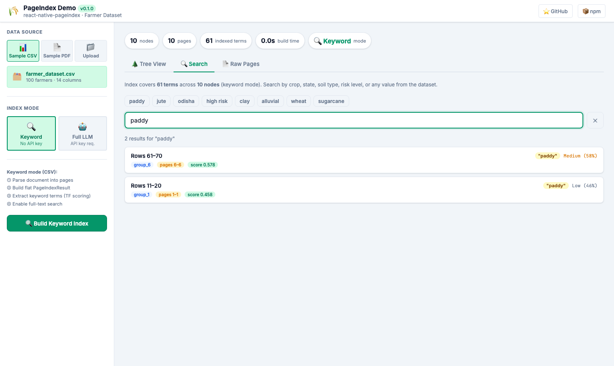
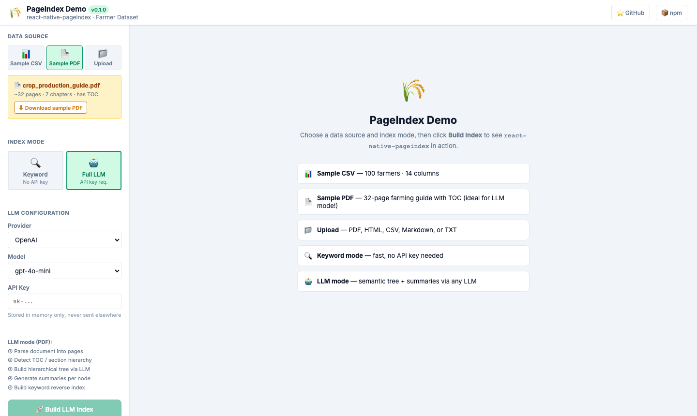

# react-native-pageindex

[](https://www.npmjs.com/package/react-native-pageindex)
[](LICENSE)

**Vectorless, reasoning-based RAG** — builds a hierarchical tree index from any document using any LLM provider. Works in React Native, Node.js, and the browser.

No vector database required. Instead of embeddings, the library uses the LLM to *reason* about document structure, producing a navigable tree that lets your AI answer questions with precise source attribution.

---

## Demo

A fully interactive React demo app is included in the [`demo/`](./demo) directory. It runs in the browser and showcases both index modes against two built-in datasets — no backend required.

### Keyword mode — instant, no API key

> CSV dataset (100 farmers · 14 columns) indexed in **0.0 s** using TF-IDF scoring.



### LLM mode — semantic tree via any LLM

> 32-page farming PDF with a TOC parsed into **31 nodes** and **250 indexed terms** in ~214 s using `gpt-4o-mini`.



---

### How the demo is built

The demo is a **Vite + React + TypeScript** single-page app that wires `react-native-pageindex` directly in the browser. Below is a walkthrough of every layer.

#### 1. Data sources (`ConfigPanel.tsx`)

Three mutually exclusive source modes are offered:

| Mode | What it loads |
|---|---|
| **Sample CSV** | `farmer_dataset.csv` — 100 rows, 14 columns (crop, state, soil type, risk…) |
| **Sample PDF** | `crop_production_guide.pdf` — 32-page farming guide generated with `pdfkit`, complete with a dot-leader TOC and 7 chapters |
| **Upload** | Any `.pdf`, `.html`, `.md`, `.csv`, or `.txt` file drag-dropped or file-picked by the user |

#### 2. Index modes (`App.tsx`)

| Mode | Description | API key needed? |
|---|---|---|
| **Keyword** | Calls `extractCsvPages` → `buildReverseIndex({ mode: 'keyword' })`. Pure TF-IDF, zero LLM calls. | ❌ No |
| **Full LLM** | Full pipeline: extract → `pageIndex` / `pageIndexMd` → `buildReverseIndex`. LLM reasons about structure, generates summaries, and builds a semantic tree. | ✅ Yes |

#### 3. The build pipeline (`App.tsx` — `handleBuild`)

```ts
// ── CSV / Keyword mode ────────────────────────────────────────────────────
import { extractCsvPages, buildReverseIndex } from 'react-native-pageindex';

const pages = await extractCsvPages(csvText, { rowsPerPage: 10 });

const result = {                            // flat PageIndexResult (no LLM)
  doc_name: fileName,
  structure: { children: pages.map((p, i) => ({ title: `Rows ${i*10+1}–${(i+1)*10}`, node_id: `g${i}`, start_index: i, end_index: i })) },
};

const index = await buildReverseIndex({ result, pages, options: { mode: 'keyword' } });


// ── PDF / LLM mode ────────────────────────────────────────────────────────
import { pageIndex, buildReverseIndex } from 'react-native-pageindex';
import { extractPdfPagesFromBuffer } from './demoExtractors';   // pdfjs-dist wrapper

const pages = await extractPdfPagesFromBuffer(arrayBuffer);     // uses pdfjs-dist v5

const result = await pageIndex({
  pages,
  docName: 'Crop Production Guide',
  llm,                                       // passed from LLM config panel
  options: {
    onProgress: ({ step, percent, detail }) => setProgress({ step, percent, detail }),
  },
});

const index = await buildReverseIndex({ result, pages, llm, options: { mode: 'keyword' } });


// ── HTML / Markdown / TXT / Upload mode ──────────────────────────────────
import { pageIndexMd, buildReverseIndex } from 'react-native-pageindex';
import { htmlToMarkdown } from './demoExtractors';

const markdown = fileType === 'html' ? htmlToMarkdown(rawText) : rawText;

const result = await pageIndexMd({
  content: markdown,
  docName: fileName,
  llm,
  options: { onProgress: setProgress },
});

const index = await buildReverseIndex({ result, llm, options: { mode: 'keyword' } });
```

#### 4. PDF extraction in the browser (`demoExtractors.ts`)

`pdfjs-dist` requires a Web Worker. In a Vite app the worker URL is resolved at build time using the `?url` import suffix:

```ts
// demoExtractors.ts
import pdfjsWorkerSrc from 'pdfjs-dist/build/pdf.worker.min.mjs?url';

export async function extractPdfPagesFromBuffer(
  buffer: ArrayBuffer,
): Promise<PageData[]> {
  const pdfjsLib = await import('pdfjs-dist');
  pdfjsLib.GlobalWorkerOptions.workerSrc = pdfjsWorkerSrc; // local, not CDN

  const pdf = await pdfjsLib.getDocument({ data: new Uint8Array(buffer) }).promise;
  const pages: PageData[] = [];

  for (let i = 1; i <= pdf.numPages; i++) {
    const pg = await pdf.getPage(i);
    const content = await pg.getTextContent();
    const text = content.items.map((item: any) => item.str).join(' ');
    pages.push({ text, tokenCount: Math.ceil(text.length / 4) });
  }
  return pages;
}
```

> **Why `?url` and not a CDN link?**
> Pointing pdfjs at an external CDN URL fails if the CDN is unreachable or CORS-blocked. The `?url` import makes Vite serve the worker file locally from the same dev-server / bundle.

#### 5. LLM provider wiring (`llm.ts`)

The demo supports OpenAI and Anthropic out of the box. It bridges each provider's SDK into the `LLMProvider` interface that `react-native-pageindex` expects:

```ts
// llm.ts — OpenAI adapter (simplified)
import type { LLMProvider } from 'react-native-pageindex';

export function makeOpenAIProvider(apiKey: string, model: string): LLMProvider {
  return async (prompt, opts) => {
    const res = await fetch(`${OPENAI_BASE}/v1/chat/completions`, {
      method: 'POST',
      headers: { 'Content-Type': 'application/json', Authorization: `Bearer ${apiKey}` },
      body: JSON.stringify({
        model,
        messages: [...(opts?.chatHistory ?? []), { role: 'user', content: prompt }],
      }),
    });
    const data = await res.json();
    if (!res.ok) throw new Error(`OpenAI ${res.status}: ${data.error?.message}`);
    return { content: data.choices[0].message.content, finishReason: data.choices[0].finish_reason };
  };
}
```

OpenAI calls in the browser are routed through a **Vite dev-server proxy** (`/llm-proxy/openai → https://api.openai.com`) to avoid CORS errors. Anthropic supports the `anthropic-dangerous-direct-browser-access: true` header so no proxy is needed.

#### 6. Progress tracking (`ProgressDisplay.tsx`)

`pageIndex` and `pageIndexMd` both fire `onProgress` callbacks after every named step. The demo displays a live progress bar and step label:

```ts
options: {
  onProgress: ({ step, percent, detail }) => {
    setProgress({ step, percent, detail }); // drives the progress bar in ProgressDisplay.tsx
  },
}
```

The PDF pipeline emits **13 named steps** (Initializing → Extracting PDF pages → Scanning for TOC → … → Done); the Markdown pipeline emits **8 steps**.

#### 7. Reverse index & search (`SearchPanel.tsx`)

After the index is built, the demo calls `buildReverseIndex` then passes the result to `searchReverseIndex` on every keystroke:

```ts
import { searchReverseIndex } from 'react-native-pageindex';

const hits = searchReverseIndex(reverseIndex, query, 20);
// hits[0] = { nodeTitle, nodeId, score, matchedTerm, totalScore, pageRange, ... }
```

Results are ranked by `totalScore` and each card shows the matched term, score, confidence level (High / Medium / Low), and the page range covered by that tree node.

#### 8. Running the demo locally

```bash
git clone https://github.com/subham11/react-native-pageindex.git
cd react-native-pageindex/demo
npm install
npm run dev            # → http://localhost:5173
```

Select **Sample CSV → Keyword** for an instant zero-API-key demo, or select **Sample PDF → Full LLM**, enter an OpenAI or Anthropic key, and click **Build LLM Index** to see the full semantic-tree pipeline in action.

---

## Features

| Feature | Detail |
|---|---|
| **Multi-format** | PDF, Word (.docx), CSV, Spreadsheet (.xlsx/.xls), Markdown |
| **Forward index** | Hierarchical tree: chapters → sections → subsections |
| **Reverse index** | Inverted index: term → node locations for fast lookup |
| **Provider-agnostic** | Pass any LLM (OpenAI, Anthropic, Ollama, Gemini…) |
| **Progress tracking** | Fine-grained per-step callbacks (13 PDF steps, 8 MD steps) |
| **Fully typed** | 100% TypeScript, `.d.ts` declarations included |
| **Optional deps** | pdfjs-dist / mammoth / xlsx are opt-in; CSV & MD have zero deps |

---

## Installation

```bash
npm install react-native-pageindex
```

### Optional format dependencies

Install only what you need:

```bash
# PDF support
npm install pdfjs-dist

# Word .docx support
npm install mammoth

# Excel / spreadsheet support
npm install xlsx
```

---

## Quick Start

### 1. Wire up your LLM provider

```ts
import OpenAI from 'openai';
import { LLMProvider } from 'react-native-pageindex';

const openai = new OpenAI({ apiKey: process.env.OPENAI_API_KEY });

const llm: LLMProvider = async (prompt, opts) => {
  const res = await openai.chat.completions.create({
    model: 'gpt-4o',
    messages: [
      ...(opts?.chatHistory ?? []),
      { role: 'user', content: prompt },
    ],
  });
  return {
    content: res.choices[0].message.content ?? '',
    finishReason: res.choices[0].finish_reason ?? 'stop',
  };
};
```

### 2. Index any document

```ts
import { pageIndexDocument } from 'react-native-pageindex';
import { readFileSync } from 'fs';

// Works with PDF, DOCX, XLSX, CSV, or Markdown
const data = readFileSync('report.pdf');

const result = await pageIndexDocument({
  data,
  fileName: 'report.pdf',   // used to auto-detect format
  docName: 'Annual Report 2024',
  llm,
  options: {
    onProgress: ({ step, percent, detail }) =>
      console.log(`[${percent}%] ${step}${detail ? ` — ${detail}` : ''}`),
  },
});

console.log(result.structure);  // hierarchical tree
```

### 3. Build a reverse index for fast search

```ts
import { buildReverseIndex, searchReverseIndex } from 'react-native-pageindex';

const reverseIndex = await buildReverseIndex({
  result,          // forward index from pageIndexDocument()
  options: {
    mode: 'keyword',   // 'keyword' (fast, no LLM) | 'llm' (semantic)
  },
});

const hits = searchReverseIndex(reverseIndex, 'revenue growth', 5);
// hits[0] = { nodeTitle, nodeId, score, matchedTerm, totalScore, ... }
```

---

## API

### `pageIndexDocument(input)` — Unified entrypoint

Accepts any supported file format and returns a hierarchical `PageIndexResult`.

```ts
interface PageIndexDocumentInput {
  data?:     ArrayBuffer | Uint8Array | string;  // binary for PDF/DOCX/XLSX; string for CSV/MD
  text?:     string;                             // convenience alias for Markdown / CSV
  fileType?: 'pdf' | 'docx' | 'csv' | 'xlsx' | 'md';  // inferred from fileName if omitted
  fileName?: string;
  docName?:  string;
  llm:       LLMProvider;
  options?:  PageIndexDocumentOptions;
}
```

`PageIndexDocumentOptions`:

| Option | Type | Default | Description |
|---|---|---|---|
| `onProgress` | `ProgressCallback` | — | Per-step progress updates |
| `pdfOptions` | `PageIndexOptions` | — | Forwarded to the PDF pipeline |
| `mdOptions` | `MdPageIndexOptions` | — | Forwarded to the Markdown pipeline |
| `csvOptions` | `CsvParseOptions` | — | CSV row-grouping & delimiter options |
| `xlsxOptions` | `XlsxParseOptions` | — | XLSX sheet selection & row-grouping |
| `tokenCounter` | `TokenCounter` | `~4 chars/token` | Custom tokeniser |

---

### `pageIndex(input)` — PDF pipeline (direct)

Use when you already have extracted pages or want PDF-specific options.

```ts
import { pageIndex, extractPdfPages } from 'react-native-pageindex';

const pages = await extractPdfPages(pdfBuffer);   // requires pdfjs-dist

const result = await pageIndex({ pages, llm, docName: 'Report' });
```

`PageIndexOptions`:

| Option | Default | Description |
|---|---|---|
| `tocCheckPageNum` | `20` | Pages to scan for table of contents |
| `maxPageNumEachNode` | `10` | Max pages per tree node |
| `maxTokenNumEachNode` | `20000` | Max tokens per tree node |
| `ifAddNodeId` | `true` | Attach unique IDs to each node |
| `ifAddNodeSummary` | `true` | LLM-generated summary per node |
| `ifAddDocDescription` | `false` | Generate overall document description |
| `ifAddNodeText` | `false` | Attach raw page text to nodes |

---

### `pageIndexMd(input)` — Markdown pipeline (direct)

```ts
import { pageIndexMd } from 'react-native-pageindex';

const result = await pageIndexMd({
  content: markdownString,
  docName: 'README',
  llm,
  options: { ifThinning: true, minTokenThreshold: 3000 },
});
```

`MdPageIndexOptions`:

| Option | Default | Description |
|---|---|---|
| `ifThinning` | `false` | Merge small sections below threshold |
| `minTokenThreshold` | `5000` | Min tokens before thinning kicks in |
| `ifAddNodeSummary` | `true` | LLM-generated summary per node |
| `summaryTokenThreshold` | `200` | Only summarise nodes above this size |
| `ifAddDocDescription` | `false` | Generate overall document description |
| `ifAddNodeText` | `false` | Attach raw section text to nodes |

---

### `buildReverseIndex(input)` — Inverted index

```ts
const reverseIndex = await buildReverseIndex({
  result,          // PageIndexResult
  pages?,          // original PageData[] (optional enrichment)
  llm?,            // required only for mode: 'llm'
  options?: {
    mode: 'keyword' | 'llm',   // default: 'keyword'
    minTermLength: number,      // default: 3
    maxTermsPerNode: number,    // default: 10
    onProgress: ProgressCallback,
  },
});
```

---

### `searchReverseIndex(index, query, topK?)` — Query the index

```ts
const results = searchReverseIndex(reverseIndex, 'machine learning', 10);

// SearchResult[]
results.forEach(r => {
  console.log(r.nodeTitle, r.totalScore, r.matchedTerm);
});
```

---

### Format parsers (lower-level)

```ts
import {
  extractPdfPages,   // requires pdfjs-dist
  extractDocxPages,  // requires mammoth
  extractCsvPages,   // no deps
  extractXlsxPages,  // requires xlsx
} from 'react-native-pageindex';

// All return: Promise<PageData[]>
// PageData = { text: string; tokenCount: number }
```

---

### Key Types

```ts
// LLM provider — wire up any AI
type LLMProvider = (
  prompt: string,
  options?: { chatHistory?: LLMMessage[] }
) => Promise<{ content: string; finishReason: string }>;

// Progress tracking
type ProgressCallback = (info: {
  step: string;
  percent: number;
  detail?: string;
}) => void;

// Forward index result
interface PageIndexResult {
  structure: TreeNode;    // root of the hierarchy
  doc_name: string;
  description?: string;
}

// Tree node
interface TreeNode {
  title?: string;
  node_id?: string;
  summary?: string;
  start_index?: number;
  end_index?: number;
  children?: TreeNode[];
  [key: string]: unknown;
}

// Reverse index search result
interface SearchResult extends ReverseIndexEntry {
  matchedTerm: string;
  totalScore: number;
}
```

---

## Progress Tracking

Both pipelines emit fine-grained progress events:

```ts
options: {
  onProgress: ({ step, percent, detail }) => {
    // PDF pipeline steps (0–100%):
    // Initializing → Extracting PDF pages → Scanning for table of contents
    // → Transforming TOC → Mapping page numbers → Building tree
    // → Verifying TOC → Fixing inaccuracies → Resolving large sections
    // → Attaching page text → Generating node summaries
    // → Generating document description → Done

    // Markdown pipeline steps:
    // Initializing → Parsing headings → Extracting section text
    // → Optimizing tree → Building tree → Generating summaries
    // → Generating description → Done

    updateProgressBar(percent);
    setStatusText(`${step}${detail ? ': ' + detail : ''}`);
  },
}
```

---

## LLM Provider Examples

### Anthropic Claude

```ts
import Anthropic from '@anthropic-ai/sdk';

const client = new Anthropic();
const llm: LLMProvider = async (prompt) => {
  const msg = await client.messages.create({
    model: 'claude-opus-4-5',
    max_tokens: 4096,
    messages: [{ role: 'user', content: prompt }],
  });
  const block = msg.content[0];
  return {
    content: block.type === 'text' ? block.text : '',
    finishReason: msg.stop_reason ?? 'stop',
  };
};
```

### Ollama (local)

```ts
const llm: LLMProvider = async (prompt) => {
  const res = await fetch('http://localhost:11434/api/generate', {
    method: 'POST',
    headers: { 'Content-Type': 'application/json' },
    body: JSON.stringify({ model: 'llama3', prompt, stream: false }),
  });
  const data = await res.json();
  return { content: data.response, finishReason: 'stop' };
};
```

### Google Gemini

```ts
import { GoogleGenerativeAI } from '@google/generative-ai';

const genAI = new GoogleGenerativeAI(process.env.GEMINI_API_KEY!);
const model = genAI.getGenerativeModel({ model: 'gemini-1.5-pro' });

const llm: LLMProvider = async (prompt) => {
  const result = await model.generateContent(prompt);
  return {
    content: result.response.text(),
    finishReason: 'stop',
  };
};
```

---

## React Native Usage

```ts
// Use RNFS or fetch to get file bytes
import RNFS from 'react-native-fs';
import { pageIndexDocument } from 'react-native-pageindex';

const base64 = await RNFS.readFile(filePath, 'base64');
const bytes = Uint8Array.from(atob(base64), c => c.charCodeAt(0));

const result = await pageIndexDocument({
  data: bytes,
  fileName: 'document.pdf',
  llm,
  options: { onProgress: setProgress },
});
```

> **Note:** pdfjs-dist has a web worker that may need special Metro configuration.
> Alternatively, pass pre-extracted `pages: PageData[]` directly to `pageIndex()` to skip pdfjs entirely.

---

## Versioning

This package follows [Semantic Versioning](https://semver.org/):

- **Patch** (`0.1.x`) — bug fixes, no API changes
- **Minor** (`0.x.0`) — new features, backward compatible
- **Major** (`x.0.0`) — breaking changes to the public API

---

## License

MIT © [subham11](https://github.com/subham11)
